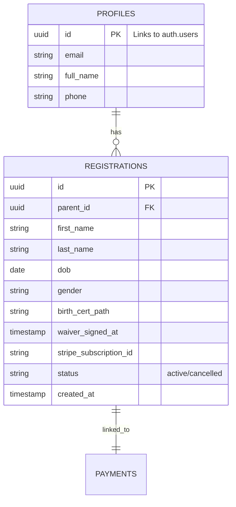

# Technical Architecture Document - Bamika FC Registration System

## 1. Architecture Design

```mermaid
graph TD
  A[User Browser] --> B[React Frontend Application]
  B --> C[Supabase SDK (Auth & Read)]
  B --> D[Express Backend API]
  D --> E[Stripe API]
  D --> F[Supabase Service (Data Write)]
  E -- Webhook --> D

  subgraph "Frontend Layer"
      B
  end

  subgraph "Backend Layer"
      D
  end

  subgraph "External Services"
      C
      E
      F
  end
```

## 2. Technology Description

* **Frontend**: React\@18 + TailwindCSS + Vite

* **Backend**: Express.js (Node.js)

* **Database**: Supabase (PostgreSQL)

* **Storage**: Supabase Storage (Birth Certificates)

* **Authentication**: Supabase Auth

* **Payments**: Stripe (Recurring Subscription)

## 3. Route Definitions

| Route           | Purpose                            |
| --------------- | ---------------------------------- |
| `/`             | Landing page                       |
| `/login`        | User authentication                |
| `/dashboard`    | Parent Dashboard (List children)   |
| `/register/new` | Multi-step registration wizard     |
| `/admin`        | Admin Dashboard (Roster & Exports) |

## 4. API Definitions

### 4.1 Express API Endpoints

| Method | Endpoint                       | Description                                                   |
| ------ | ------------------------------ | ------------------------------------------------------------- |
| POST   | `/api/create-checkout-session` | Receives player data & waiver; creates Stripe Session.        |
| POST   | `/webhook/stripe`              | Listens for `checkout.session.completed`; saves player to DB. |
| POST   | `/api/upload-url`              | Generates signed URL for secure file upload to Supabase.      |

### 4.2 Core Types

```typescript
interface PlayerRegistration {
  parent_id: string; // UUID
  first_name: string;
  last_name: string;
  dob: string; // ISO Date
  gender: 'Male' | 'Female';
  birth_cert_url: string;
  waiver_signed_at: string; // ISO Timestamp
  medical_conditions?: string;
}
```

## 5. Data Model

### 5.1 Entity Relationship Diagram



### 5.2 Data Definition Language (DDL)

```sql
-- Profiles table (extends auth.users)
create table public.profiles (
  id uuid references auth.users not null primary key,
  full_name text,
  phone text,
  created_at timestamptz default now()
);

-- Registrations table
create table public.registrations (
  id uuid default gen_random_uuid() primary key,
  parent_id uuid references public.profiles(id) not null,
  first_name text not null,
  last_name text not null,
  dob date not null,
  gender text not null,
  birth_cert_path text not null,
  waiver_signed_at timestamptz not null,
  medical_conditions text,
  stripe_subscription_id text,
  status text default 'active',
  created_at timestamptz default now()
);

-- Enable RLS
alter table public.profiles enable row level security;
alter table public.registrations enable row level security;

-- Policies
create policy "Parents can view their own children" on public.registrations
  for select using (auth.uid() = parent_id);
```

